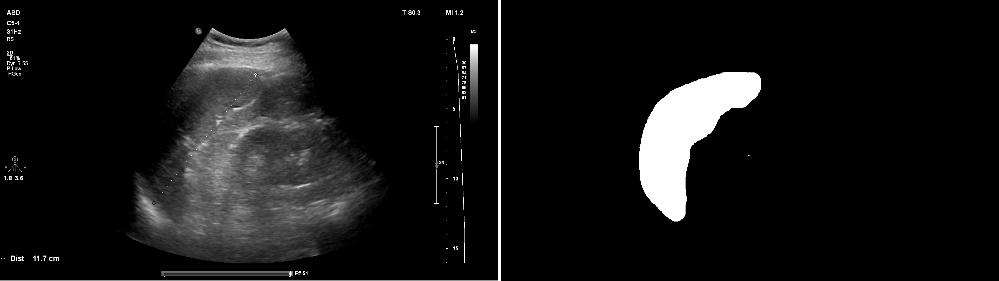

# UT Spleen Dataset

The UT Kidney dataset comprises 450 ultrasound images from 450 different patients. Each image in the dataset includes the following files:

- DICOM file: Original DICOM file for each ultrasound image. 
- Original PNG file: PNG format of the original ultrasound image. 
- Label NRRD file: NRRD format of the labeled ultrasound image. 
- Label PNG file: PNG format of the labeled ultrasound image. 
- Segmented points TXT file: Text file containing segmented points for each image.

## Dataset Details


- Total images: 450
- Total patients: 450
- Gender : 
- Age Range : 

<br/>
<p align="center">
    <br/>
	Figure 1. UT Spleen Dataset
</p>

## Dataset Structure

Below is a overview of the UT Spleen dataset.

```bash
UT_spleen_dataset.zip
    |
    |── Images (directories of user_id names)
    |     ├── 1 
    |     |    |── 1.dcm
    |     |    |── 1.png
    |     |── 2
    |     |    |── 2.dcm
    |     |    |── 2.png
    |     |
    |     └── .....   
    └── Masks (directories of user_id names)
    |     ├── 1 
    |     |    |── 1.png
    |     |    |── 1.txt
    |     |── 2
    |     |    |── 2.png
    |     |    |── 2.txt
    |     |
    |     └── .....                      
```

## How to download dataset


You can download the dataset from [here](https://forms.gle/SPYEEmpkX7peAtyB8)

## Contact us

Feel free to contact us for any further information via below channels.

- Email: [*alikarimi120@gmail.com*](alikarimi120@gmail.com)


## Citation

If you use this dataset in your research, please cite the following paper:

```
@article{UT,
  title={Title},
  author={Name},
  journal={arXiv},
  year={2021}
}
```

## License

[Specify the license under which the dataset is distributed, if applicable.]


